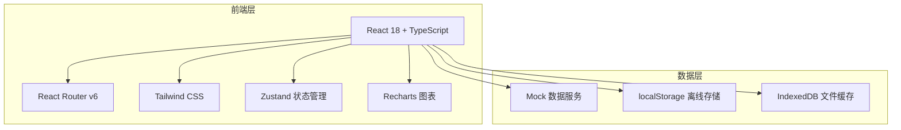
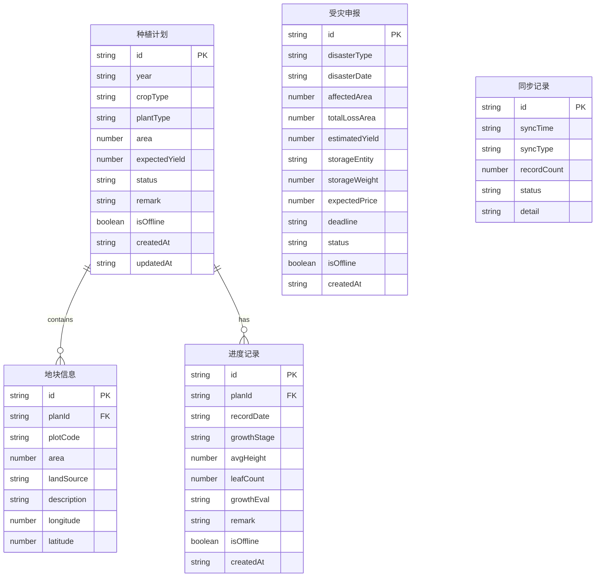

# 青贮饲料管理分系统移动端APP - 技术架构文档

## 1. 架构设计

## 2. 技术说明

- **前端框架**：React 18 + TypeScript
- **构建工具**：Vite
- **路由**：React Router v6
- **样式方案**：Tailwind CSS 3
- **状态管理**：Zustand
- **图表库**：Recharts
- **图标库**：Lucide React
- **地图**：模拟地图展示（使用SVG/Canvas模拟，不依赖高德API Key）
- **初始化工具**：vite-init (react-ts模板)
- **后端**：无后端，使用Mock数据
- **离线存储**：localStorage + 内存状态管理

## 3. 路由定义

| 路由 | 用途 |
|------|------|
| `/` | 首页 - 种植概况、待办事项、快捷入口 |
| `/tasks` | 任务管理 - 种植计划列表 |
| `/tasks/new` | 新增种植计划申报 |
| `/tasks/:id` | 查看/编辑种植计划详情 |
| `/map` | 一张图 - 地图展示 |
| `/progress` | 进度跟踪 - 进度列表 |
| `/progress/new` | 进度填报 |
| `/progress/:id` | 进度记录详情 |
| `/disaster` | 受灾申报列表 |
| `/disaster/new` | 受灾申报填报 |
| `/disaster/:id` | 受灾申报详情 |
| `/offline` | 离线数据管理 |
| `/statistics` | 统计分析 |
| `/profile` | 个人中心 |
| `/profile/edit` | 编辑个人信息 |
| `/plot/edit` | 地块信息编辑 |

## 4. 数据模型

### 4.1 数据模型定义

### 4.2 Mock数据定义

使用内存中的Mock数据模拟所有业务数据，包含：
- 种植计划数据（5条，含不同状态）
- 地块数据（10条，关联种植计划）
- 进度记录数据（8条，含离线标记）
- 受灾申报数据（3条，含预警标记）
- 同步历史数据（5条）
- 统计数据
- 用户信息

## 5. 状态管理设计

使用Zustand管理全局状态：

- **useAppStore**：用户信息、网络状态、离线数据管理
- **usePlanStore**：种植计划CRUD、地块管理
- **useProgressStore**：进度记录CRUD
- **useDisasterStore**：受灾申报CRUD
- **useSyncStore**：同步状态、同步历史

## 6. 组件设计

### 6.1 布局组件

| 组件名 | 说明 |
|--------|------|
| `AppLayout` | 主布局框架，含顶部导航+底部Tab |
| `BottomNav` | 底部导航栏（首页/任务/地图/统计/我的） |
| `TopBar` | 顶部导航栏 |
| `OfflineBanner` | 离线状态提示条 |

### 6.2 业务组件

| 组件名 | 说明 |
|--------|------|
| `PlanCard` | 种植计划卡片 |
| `ProgressCard` | 进度记录卡片 |
| `DisasterCard` | 受灾申报卡片 |
| `PlotEditor` | 地块编辑弹窗 |
| `PhotoUploader` | 照片上传组件 |
| `MapLayerControl` | 图层控制弹窗 |
| `MapPopup` | 地图弹窗（主体/地块） |
| `SyncItem` | 同步数据条目 |
| `StatCard` | 统计数据卡片 |
| `TrendChart` | 趋势折线图 |

### 6.3 通用组件

| 组件名 | 说明 |
|--------|------|
| `StatusBadge` | 状态标签（不同颜色） |
| `EmptyState` | 空状态提示 |
| `FilterTabs` | 筛选标签栏 |
| `FormSection` | 表单分组 |
| `Progress` | 进度条 |
